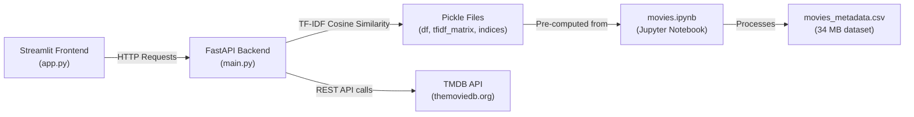

# 🎬 Movie Recommender — Full Project Overview

## What It Is
A **content-based movie recommendation system** with a two-tier architecture:
- **Backend**: FastAPI REST API serving movie data and recommendations
- **Frontend**: Streamlit web UI for browsing, searching, and discovering movies

The system uses **TF-IDF (Term Frequency–Inverse Document Frequency)** cosine similarity on movie metadata to find similar movies, supplemented by **TMDB genre-based discovery** for broader recommendations.

---

## Architecture



---

## Tech Stack

| Layer | Technology | Version |
|-------|-----------|---------|
| Language | Python | 3.11.9 |
| Backend Framework | FastAPI | 0.111.0 |
| ASGI Server | Uvicorn | 0.30.1 |
| Frontend Framework | Streamlit | 1.36.0 |
| HTTP Client | httpx | 0.27.0 |
| Data Processing | Pandas | 2.2.2 |
| Numerical Computing | NumPy | 2.0.1 |
| Sparse Matrices | SciPy | 1.13.1 |
| ML (TF-IDF Vectorizer) | scikit-learn | 1.5.1 |
| Env Management | python-dotenv | 1.0.1 |
| External API | TMDB (The Movie Database) | v3 |

---

## File Structure

| File | Size | Purpose |
|------|------|---------|
| [main.py](file:///c:/Users/Lenovo/Downloads/movie-rec-main/movie-rec-main/main.py) | 13.7 KB | FastAPI backend — API routes, TF-IDF engine, TMDB integration |
| [app.py](file:///c:/Users/Lenovo/Downloads/movie-rec-main/movie-rec-main/app.py) | 12.2 KB | Streamlit frontend — UI, search, poster grid, detail pages |
| [movies.ipynb](file:///c:/Users/Lenovo/Downloads/movie-rec-main/movie-rec-main/movies.ipynb) | 125 KB | Jupyter notebook — data preprocessing & model training |
| [movies_metadata.csv](file:///c:/Users/Lenovo/Downloads/movie-rec-main/movie-rec-main/movies_metadata.csv) | 34.4 MB | Raw movie dataset (source data) |
| [df.pkl](file:///c:/Users/Lenovo/Downloads/movie-rec-main/movie-rec-main/df.pkl) | 29.6 MB | Preprocessed DataFrame (pickled) |
| [tfidf_matrix.pkl](file:///c:/Users/Lenovo/Downloads/movie-rec-main/movie-rec-main/tfidf_matrix.pkl) | 18.9 MB | Precomputed TF-IDF sparse matrix |
| [tfidf.pkl](file:///c:/Users/Lenovo/Downloads/movie-rec-main/movie-rec-main/tfidf.pkl) | 1.9 MB | Fitted TF-IDF vectorizer object |
| [indices.pkl](file:///c:/Users/Lenovo/Downloads/movie-rec-main/movie-rec-main/indices.pkl) | 1.4 MB | Movie title → matrix index mapping |
| [requirements.txt](file:///c:/Users/Lenovo/Downloads/movie-rec-main/movie-rec-main/requirements.txt) | 147 B | Python dependencies |
| [runtime.txt](file:///c:/Users/Lenovo/Downloads/movie-rec-main/movie-rec-main/runtime.txt) | 14 B | Python runtime version (for Render deployment) |

---

## How the Recommendation Engine Works

### 1. Data Preprocessing (movies.ipynb)
- Loads `movies_metadata.csv` (raw dataset)
- Cleans and processes movie features (overview, genres, keywords, etc.)
- Builds a **TF-IDF vectorizer** on combined text features
- Computes the **TF-IDF sparse matrix** (document-term matrix)
- Creates a **title → index mapping** for fast lookups
- Serializes everything as `.pkl` files

### 2. TF-IDF Content-Based Filtering (main.py)
- On startup, loads all 4 pickle files into memory
- Given a movie title, looks up its index in the TF-IDF matrix
- Computes **cosine similarity** between the query movie's TF-IDF vector and all other movies: `scores = tfidf_matrix @ query_vector.T`
- Returns the top-N most similar movies sorted by descending score

### 3. Genre-Based Discovery (TMDB API)
- Fetches the selected movie's genres from TMDB
- Uses TMDB's `/discover/movie` endpoint to find popular movies in the same genre
- Acts as a complementary recommendation source

---

## API Endpoints (Backend)

| Method | Endpoint | Description |
|--------|----------|-------------|
| `GET` | `/health` | Health check |
| `GET` | `/home?category=&limit=` | Home feed — trending, popular, top_rated, upcoming, now_playing |
| `GET` | `/tmdb/search?query=&page=` | TMDB keyword search (returns raw TMDB results for suggestions + grid) |
| `GET` | `/movie/id/{tmdb_id}` | Movie details (poster, overview, genres, backdrop) |
| `GET` | `/recommend/genre?tmdb_id=&limit=` | Genre-based recommendations via TMDB Discover |
| `GET` | `/recommend/tfidf?title=&top_n=` | TF-IDF only recommendations (debug endpoint) |
| `GET` | `/movie/search?query=&tfidf_top_n=&genre_limit=` | **Bundle endpoint** — details + TF-IDF recs + genre recs in one call |

---

## Frontend Features (Streamlit)

### Home Page
- **Search bar** with real-time keyword search via TMDB API
- **Autocomplete dropdown** with top 10 suggestions (title + year)
- **Poster grid** displaying search results or home feed
- **Category selector**: trending, popular, top_rated, now_playing, upcoming
- **Adjustable grid columns** (4–8)

### Details Page
- Movie poster, title, release date, genres, overview
- Backdrop image
- **TF-IDF recommendations** — "Similar Movies" based on content similarity
- **Genre recommendations** — "More Like This" from TMDB discover
- Navigation with query params (`?view=details&id=12345`)

---

## Deployment

- **Backend** deployed on **Render**: `https://movie-rec-466x.onrender.com`
- **Runtime**: Python 3.11.9 (specified in `runtime.txt`)
- Requires `TMDB_API_KEY` environment variable (in `.env` file)

---

## How to Run Locally

```bash
# 1. Install dependencies
pip install -r requirements.txt

# 2. Create .env file with your TMDB API key
echo "TMDB_API_KEY=your_api_key_here" > .env

# 3. Start the FastAPI backend
uvicorn main:app --reload --port 8000

# 4. (In another terminal) Start the Streamlit frontend
streamlit run app.py
```

---

## Key Design Decisions

1. **Pre-computed TF-IDF matrix** — Loaded once at startup for instant recommendations (no training at runtime)
2. **Hybrid recommendation** — TF-IDF for content similarity + TMDB genre discovery for broader exploration
3. **Graceful fallbacks** — If TF-IDF fails for a title, falls back to genre-only recommendations
4. **CORS enabled** — `allow_origins=["*"]` for easy local Streamlit ↔ FastAPI communication
5. **Cached API calls** — Streamlit uses `@st.cache_data(ttl=30)` for short-lived caching
6. **Pydantic models** — Type-safe response schemas (`TMDBMovieCard`, `TMDBMovieDetails`, `SearchBundleResponse`)
